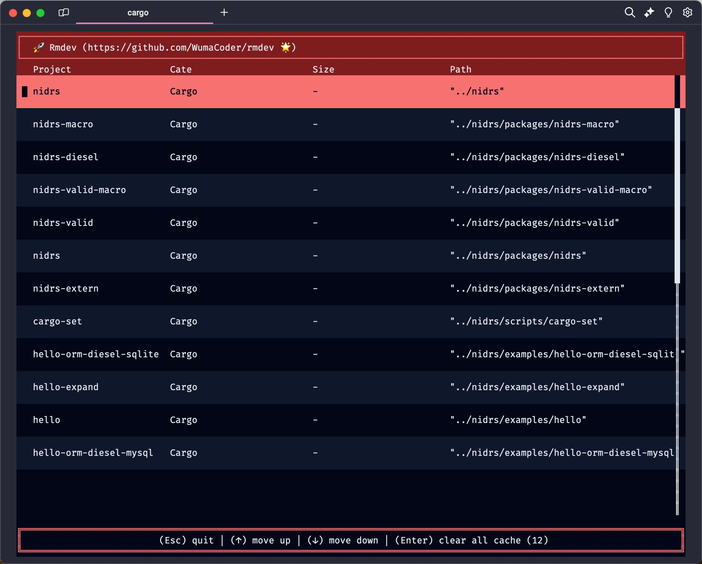

<div align="center">
  <p>
    <h1>Rmdev</h1>
  </p>
  <p></p>
  <p>
    
    
  </p>
</div>

This is a tool to delete the remaining dependencies and cache files in the development environment, eg: nodule_modules、target...

## Feature

- 🌟 batch deletion
- 🚀 fast deletion
- 🗑 support multi lang
  - nodejs (nodule_modules)
  - rust (target)
  - ...

## Install

```shell
curl --proto '=https' --tlsv1.2 -sSf https://sh.rustup.rs | sh

cargo install rmdev
```

## Use

```shell
rmdev clear ~/

# ~/ scan all project.
```

## Help

```shell
rmdev clear --help
```

## About

MIT
